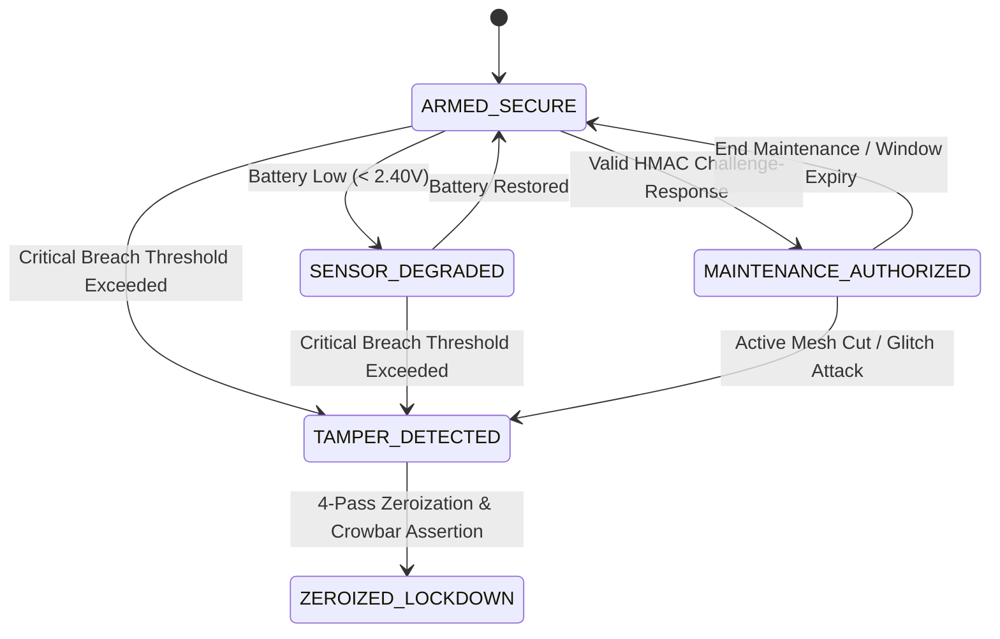

# Chassis Tamper Sensor Interlock & Cryptographic Zeroization Engine

A high-assurance, zero-dependency Python implementation of physical enclosure intrusion detection and hardware-level cryptographic key zeroization interlocks, designed to meet **FIPS 140-3 Physical Security Level 4** and **NIST SP 800-88 Rev 1** sanitization guidelines for Hardware Security Modules (HSMs) and secure edge crypto-appliances.

---

## Security Architecture & Threat Vectors

Physical attacks against cryptographic modules include unauthorized lid opening, mechanical drilling, continuous wire mesh cutting or micro-probing, cryogenic freeze (cold boot memory remanence), thermal cutting (laser or heat gun), power rail glitching, and magnetic reed switch tampering.

This engine monitors an active multi-sensor telemetry envelope in real-time, executing sub-millisecond interlock actions and 4-pass NIST SP 800-88 memory zeroization upon confirmed breach detection.

---

## Monitored Physical Sensor Array & Attack Thresholds

| Sensor Domain | Nominal Envelope | Attack / Breach Threshold | Attack Vector Mitigated |
| :--- | :--- | :--- | :--- |
| **Lid Microswitch** | `CLOSED` (False) | `OPEN` (True) | Physical enclosure access |
| **Active Serpentine Mesh** | $1000\,\Omega \pm 15\%$ ($750 - 1250\,\Omega$) | $< 750\,\Omega$ (Short) or $> 1250\,\Omega$ (Cut) | Micro-probing, PCB milling, wire drilling |
| **Optical Photodiode** | $< 0.5\,\text{Lux}$ (Dark cavity) | $\ge 2.0\,\text{Lux}$ | Light intrusion via pinhole or drill aperture |
| **3-Axis Accelerometer** | $< 1.5\,\text{g}$ | $\ge 3.5\,\text{g}$ | High kinetic shock, drilling vibration |
| **Thermal Sensor** | $-10^\circ\text{C}$ to $+65^\circ\text{C}$ | $< -20^\circ\text{C}$ or $> +70^\circ\text{C}$ | Cold boot SRAM freeze / thermal torch attack |
| **Magnetic Hall Effect** | $< 2.0\,\text{Gauss}$ | $\ge 8.0\,\text{Gauss}$ | External rare-earth magnet manipulation |
| **Core Rail Voltage** | $3.30\,\text{V} \pm 5\%$ ($3.13 - 3.46\,\text{V}$) | $< 3.00\,\text{V}$ or $> 3.60\,\text{V}$ | Glitch injection, fault attack, brownout |
| **RTC Backup Battery** | $> 2.70\,\text{V}$ | $< 2.40\,\text{V}$ | Battery exhaustion / degraded auxiliary monitoring |

---

## Finite State Machine (FSM) & Zeroization Protocol



### NIST SP 800-88 Zeroization Sequence:
1. **Pass 1**: Overwrite volatile BBRAM / Key Registers with `0x00`.
2. **Pass 2**: Overwrite with `0xFF`.
3. **Pass 3**: Overwrite with cryptographically secure pseudo-random bytes.
4. **Pass 4**: Overwrite with `0x00`.
5. **Hardware Isolation**: Assert crowbar FET / battery discharge.
6. **Audit Attestation**: Generate HMAC-SHA256 tamper proof with monotonic sequence ID and hardware timestamp.

---

## Project Structure

```
chassis-tamper-sensor-interlock/
├── chassis_tamper_interlock.py # Core pure-Python anti-tamper & zeroization engine
├── chassis_tamper_app.py       # Module export entry point
├── cli.py                      # Interactive security console & batch CLI
├── test_chassis_tamper.py      # Comprehensive test suite (27+ test cases)
├── benchmark_dataset.json      # Standard security validation benchmark cases
├── sample.csv                  # Sample multi-sensor telemetry log
├── sample_payload.json         # Real-time HSM sensor payload sample
├── Dockerfile                  # Production container definition
├── docker-compose.yml          # Container orchestration
└── README.md                   # Technical specification & security manual
```

---

## CLI Usage

### 1. Interactive Security Sensor Console
```bash
python cli.py interactive
```

### 2. Real-Time Telemetry Evaluation
```bash
# Evaluate normal armed state
python cli.py eval --mesh-ohms 1000.0 --temp-c 24.5

# Evaluate simulated lid intrusion attack with JSON output
python cli.py eval --microswitch-open --light-lux 15.0 --json
```

### 3. Authorized Maintenance Mode
```bash
# Generate 5-minute maintenance challenge token
python cli.py maintenance-challenge --duration 300
```

### 4. Emergency Manual Zeroization
```bash
python cli.py zeroize --reason "HOST_COMPROMISE_DECOMMISSION" --json
```

### 5. Batch Sensor Log Audit
```bash
python cli.py batch -i sample.csv -o tamper_audit_results.csv
```

---

## Programmatic Usage

```python
from chassis_tamper_interlock import evaluate_chassis_telemetry, InterlockState

res = evaluate_chassis_telemetry(
    microswitch_open=False,
    mesh_resistance_ohms=1000.0,
    internal_light_lux=0.0,
    temperature_c=25.0,
    rail_voltage_v=3.30,
)

print(f"State: {res.interlock_state.value}")
print(f"Severity: {res.overall_severity.value}")
print(f"Breached: {res.is_breached}")
if res.requires_zeroization:
    print(f"Zeroization HMAC: {res.zeroization_proof.audit_hmac_sha256}")
```

---

## Unit Testing

Run all unit tests using `unittest`:

```bash
python -m unittest discover -s . -p "test_*.py" -v
```

Test coverage includes:
- All 8 physical tamper sensor thresholds and nominal boundaries.
- Cold boot cryogenic freeze ($-35^\circ\text{C}$) and thermal cutting attacks ($+85^\circ\text{C}$).
- Power rail voltage brownout and overvoltage glitching detection.
- FSM state transitions (`ARMED_SECURE` $\to$ `MAINTENANCE_AUTHORIZED` $\to$ `ZEROIZED_LOCKDOWN`).
- Dual-custody HMAC challenge-response authentication.
- NIST SP 800-88 multi-pass zeroization verification and monotonic audit hashing.

---

## References

1. **NIST FIPS PUB 140-3** (2019). *Security Requirements for Cryptographic Modules*. National Institute of Standards and Technology.
2. **NIST SP 800-88 Rev. 1** (2014). *Guidelines for Media Sanitization*. NIST Special Publication.
3. **Anderson R, Kuhn M** (1996). *Tamper Resistance — a Cautionary Note*. USENIX Workshop on Electronic Commerce.

---

## License

MIT License. Developed for high-assurance embedded hardware security research.
